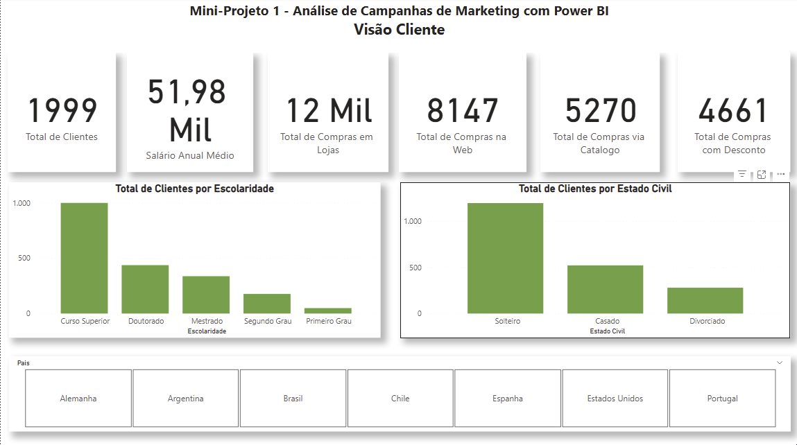
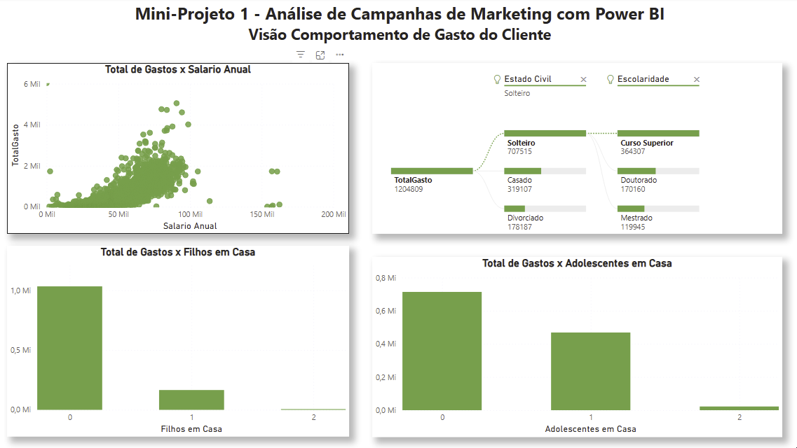
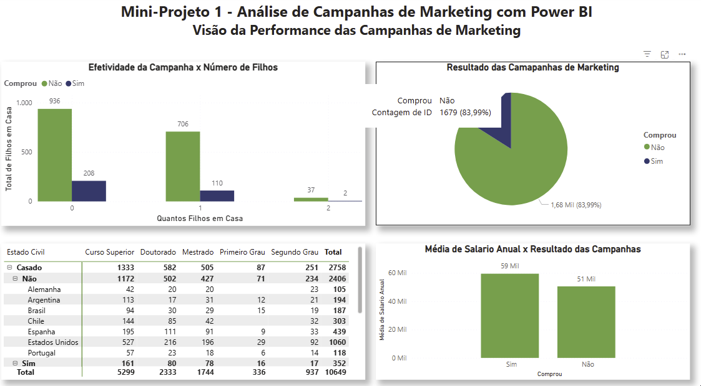
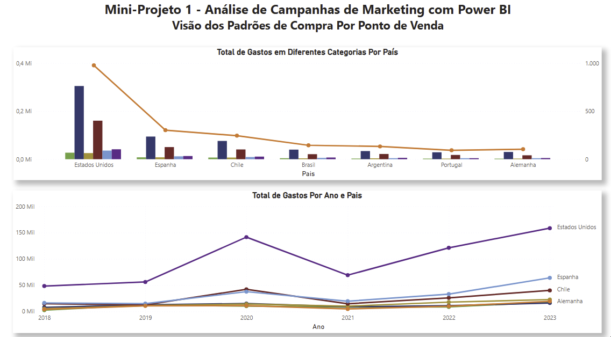

# powerbi-analise-campanhas-marketing-2025
Dashboard em Power BI para análise de campanhas de marketing: funil, performance por canal, CTR, CPA, ROI e insights acionáveis.

# Análise de Campanhas de Marketing — Power BI

Este dashboard interativo foi desenvolvido para explorar o perfil de clientes, hábitos de compra e desempenho de campanhas de marketing. A análise combina dados demográficos, comportamento de consumo, canais de compra e participação em campanhas, permitindo identificar padrões e direcionar estratégias mais assertivas.

---

## Objetivo
O projeto visa:
- Segmentar clientes com base em dados demográficos e comportamentais
- Avaliar gastos por categoria de produto
- Medir o engajamento e a taxa de conversão de campanhas de marketing
- Fornecer insights para otimizar investimentos em canais e campanhas

---

## Ferramentas e técnicas
- **Power BI Desktop** (Power Query, Modelagem de Dados, DAX)
- **Power Query** para limpeza, tratamento e padronização dos dados
- **DAX** para criação de KPIs e métricas personalizadas
- **Design com storytelling**, priorizando clareza visual e navegação intuitiva

---

## Dataset
Arquivo: [`dataset/dados_marketing.csv`](dataset/dados_marketing.csv)  
Base simulada de marketing, com 27 colunas e dados de clientes, compras e campanhas.

**Principais campos:**
- **Perfil do cliente:** Ano de Nascimento, Escolaridade, Estado Civil, Salário Anual, Filhos e Adolescentes em Casa, País
- **Histórico de compras:** número de compras (Web, Catálogo, Loja), compras com desconto, visitas ao site
- **Gastos por categoria:** Eletrônicos, Brinquedos, Móveis, Utilidades, Alimentos, Vestuário
- **Campanhas:** indicadores de compra nas Campanhas 1 a 5, variável final "Comprou"
- **Datas:** Data de cadastro, dias desde a última compra

Dicionário de dados: [`dataset/dicionario_dados.md`](dataset/dicionario_dados.md)

---

## Modelagem e Medidas DAX
**Modelagem:**
- Tabela fato com dados transacionais e campanhas
- Dimensão tempo (criada no Power BI)
- Relacionamentos otimizados para segmentações por data e país

**Principais medidas criadas:**
- Total Gasto = soma de todas as categorias de produto
- Ticket Médio = Total Gasto / Total de Compras
- Taxa de Conversão por Campanha = Comprou / Total impactado
- Engajamento no Site = Média de visitas/mês
- Distribuição de compras por canal (Web, Catálogo, Loja)

---

## Páginas e Visualizações
O dashboard está organizado em **quatro páginas principais**:

1. **Visão Cliente**
   - KPIs: total de clientes, gasto médio, taxa geral de conversão
   - Distribuição demográfica (idade, estado civil, escolaridade)
   - Mapa por país

2. **Visão Comportamento**
   - Gastos por categoria de produto
   - Comparação de canais (web, catálogo, loja)
   - Ticket médio por canal
   - Comportamento de visitas ao site

3. **Visão Campanha**
   - Taxa de conversão de cada campanha (1 a 5)
   - Comparação de campanhas por perfil de cliente
   - Gráficos de barras/colunas com filtros dinâmicos

4. **Visão Produtos de Venda**
   - **Total de Gastos por Categoria**: gráfico combinado (colunas para valores absolutos e linha para volume/contagem)
   - **Total de Gastos por Ano e País**: gráfico de linhas comparando tendências de consumo por localização ao longo do tempo
---

## Principais insights (exemplos)
- **Campanha 3** apresentou a maior taxa de conversão geral
- Clientes com escolaridade mais alta tendem a ter ticket médio superior
- Canais físicos (loja) geram ticket médio maior que canais digitais
- Alguns países têm maior engajamento digital, refletido em mais visitas ao site

---

## ▶️ Como abrir
1. Baixe o arquivo [`Mini-Projeto 1 - Análise de Campanhas de Marketing.pbix`](./projeto.pbix) disponível neste repositório.
2. Abra o arquivo no **Power BI Desktop** (disponível gratuitamente no site da Microsoft).
3. Todas as páginas do dashboard estarão disponíveis para navegação local.

> Exemplo de visualizações:

  
  
  
  

> ℹ️ Este projeto utiliza dados fictícios e pode ser aberto e explorado livremente no Power BI Desktop, sem necessidade de conexão a banco de dados externo.
---

## 📄 Licença
Este projeto é distribuído sob a licença MIT. Veja `LICENSE` para detalhes.
